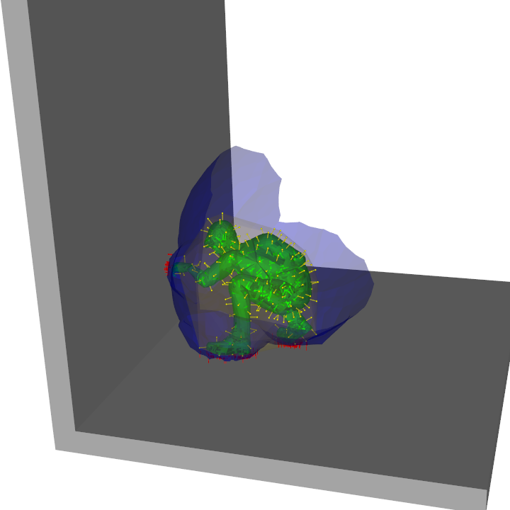
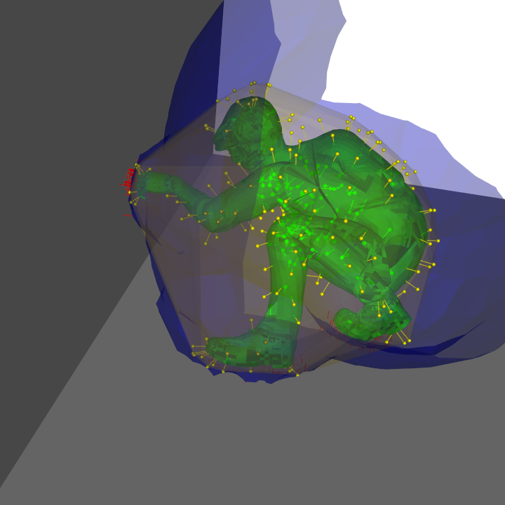
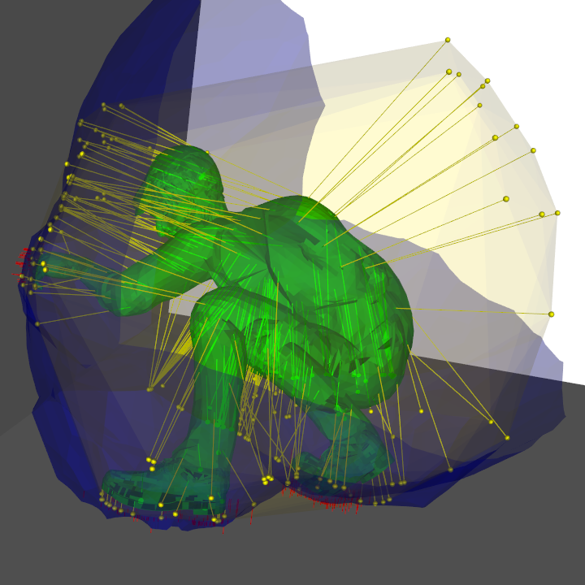
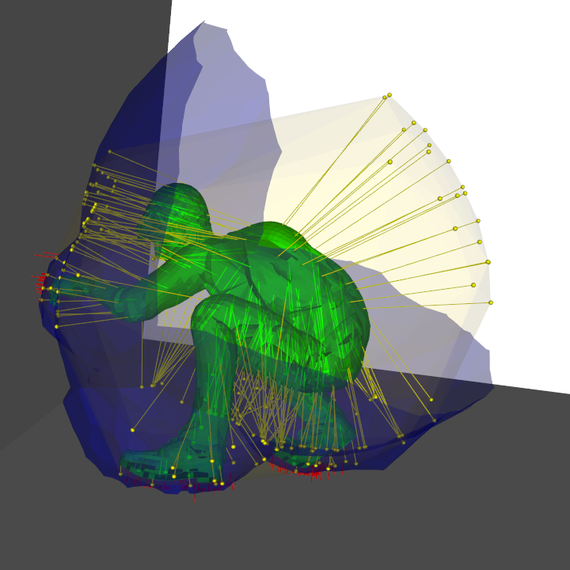
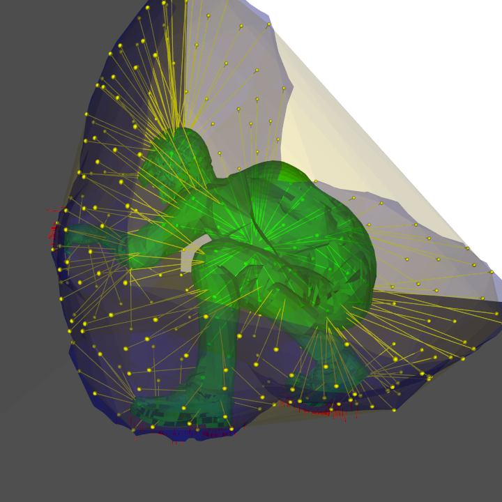

# iTpyClearance

**Prerequisites**: Install and and to PYTHONPATH iTpy https://github.com/dougbel/iTpy

## PropagateNormalObjectPoissonDiscSamplerClearance
Generates clearance vectors by
1. poisson sampling on object,
2. calculate normal for every sample in object
3. follow direction of normal until reaching IBS or the sphere of influence
4. starting point of clearance vector in the sampling normal direction no further than threshold or IBS
5. vector goes from IBS or a point farther than DISTANCE_THRESHOLD to the sampling point in object

## PropagateObjectNormalFromSpherePoissonDiscSamplerClearance
 Generates clearance vectors by
1. sampling on a sphere of influence,
2. generate rays from samples to the sphere centre
3. find intersection of rays in object obtaining OBJECT SAMPLES
   
        IF NO INTERSECTION: find the nearest point from every "circle sample" in object
4. calculate normal for every sample in object
5. follow direction of normal until reaching IBS or the sphere of influence
6. starting point of clearance vector in the sampling normal direction no further than threshold or IBS

## PropagateFromSpherePoissonDiscSamplerClearance
Generates clearance vectors by
1. sampling on a sphere of influence,
2. generate rays from samples to the sphere centre
3. find intersection of rays in object obtaining OBJECT SAMPLES
        
        IF NO INTERSECTION: find the nearest point from "circle sample" to object
4. finding nearest point from OBJECT SAMPLES to IBS

## OnObjectPoissonDiscSamplerClearance
Generates clearance vectors by
1. poisson disc sampling on object
2. finding the nearest point from OBJECT SAMPLES to ( IBS U Sphere_of_influence)

## OnIBSPoissonDiscSamplerClearance
Generates provenance vectors by sampling on the IBS and extend them to the nearest point in the object

